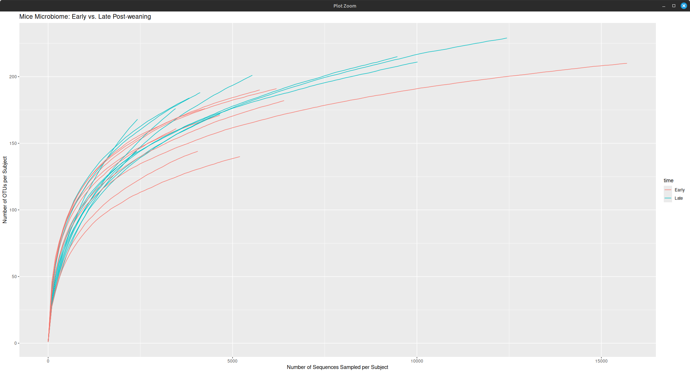

This project is based on this tutorial: https://mothur.org/wiki/miseq_sop/

Here is the tech being used:
- nextflow
- docker
- mothur
- linux

Here is a rarecurve for the OTU-based analysis:

The goal of this study was to compare the gut microbiome richness of mice post-weaning between 1-9 days (Early) and 140-150 days (Late). 

I would definitely expect the Late group to have a greater diversity of species in their gut microbiome compared to the early group since their microbiome was still mostly based on the mother's milk.

Citation:
Kozich JJ, Westcott SL, Baxter NT, Highlander SK, Schloss PD. (2013): Development of a dual-index sequencing strategy and curation pipeline for analyzing amplicon sequence data on the MiSeq Illumina sequencing platform. Applied and Environmental Microbiology. 79(17):5112-20.